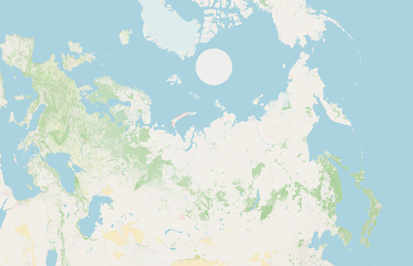
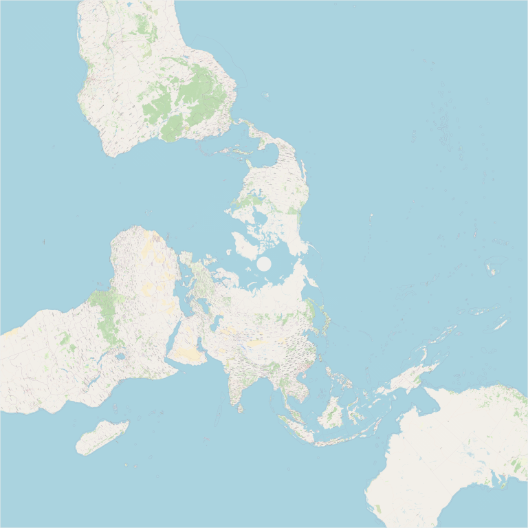

# EPSG 3576 tiles
Прототип проекта для частного применения: замены отключенных карт канадского института исследований Арктики.
Автор не несет ответственности за применение сторонними лицами*

Предназначен для запуска на MacOS с х2 разрешением рендеринга**
- Рендерит полярную проекцию из тайлов OSM
- Требует Firefox + FirefoxDriver для работы Selenuim
- Требует запущенного (локального) веб-сервера, чтобы корректно подгружать код сайта в Firefox

Принцип работы:
1. Основной код на Java управляет веб-сайтом в Firefox
2. Сайт настроен для конвертирования тайлов WebMercator -> Polar
3. Java позиционирует и сохраняет скриншот окна Firefox, в котором отображен текущий расчетный тайл

Дополнительные утилиты:
1. Просмотрщик тайлов
2. Конвертер PNG 512x512 -> 256x256
3. Билдер превью карты слоя, по которой визуально можно оценить результат и возможные ошибки

*Используйте собственный сервер тайлов, например tileserver-gl + .mbtiles Maptiler
**Для других систем требуется поменять настройки обрабатываемых разрешений, и изменить в FireFox свойство минимального размера окна.

Образец полной карты мира:

